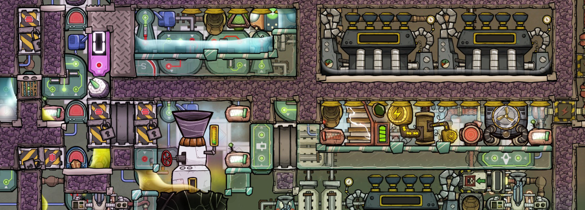
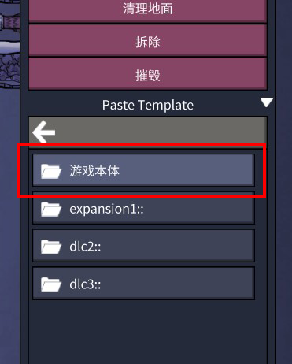

# ONl-templates

这是用于《缺氧》这款游戏的一些模块的yaml地形模板文件的合集。这些yaml文件用于在Debug模式中使用调试工具将模块直接整体打印并进行测试，而不用手动重新搭建。

这包括一些间歇泉、工业模块等，均为我自己会用的模块，保存在这里以免丢失。包含的具体模块请参考本仓库文件的文件名称。

这其中大部分模块的建造目标都是尽可能少得浪费资源，包括物质和热量。这些模块的热处理都是比较完备的，热交换路径是清晰且明确的，几乎所有资源和热量都将得到妥善处理。这些模块所利用到的主要规则均为“一格一物”和热交换机制等比较基础的游戏机制。

大部分模块建成于游戏版本：U54，如果部分模块所涉及的机制在后续游戏版本中被改动，我将适时进行更新。

这些模块的详细文档参见：我的[b站专栏](https://www.bilibili.com/read/cv40714184)。跳转后请在**专栏文集**中手动选择你需要的模块进行跳转。

## Usage

1. clone此仓库，或点击页面右上方“Code”按钮Download Zip或点击链接将所有文件整体[下载](https://github.com/IncubatorT/OxygenNotIncluded-templates/archive/refs/heads/main.zip)。或者单独下载你想要的模块的单个yaml文件。

2. 将yaml文件或包含yaml文件的文件夹放置于指定路径中：%Steam%\steamapps\common\OxygenNotIncluded\OxygenNotIncluded_Data\StreamingAssets\templates
   
   * 找到游戏根目录：打开steam，在库中选中游戏右键属性->已安装文件->浏览
   
   * OxygenNotIncluded_Data\StreamingAssets\templates

3. 启动游戏并启用Debug模式：在游戏主界面直接输入“kleiplay”（没有字符键入位置但请直接输入），完成后，游戏版本号后缀出现一个额外的字符“D”后说明启动成功。在此模式进行游戏时将禁用成就，请不要进入你的生存模式存档，重新新建一个存档并启用沙盒模式。测试完成后完全关闭游戏，重启游戏即可退出Debug模式，恢复正常状态。

4. 载入游戏地图后按退格键“BackSpace”启用调试工具，Debug工具需要与沙盒工具配合使用，推荐同时启用沙盒模式。在屏幕右侧的“Paste Template”工具中进入路径“游戏本体”，这里保存的就是游戏自带的各种特质、间歇泉等预设结构，进入“myTemplates”（或由你命名的文件夹）就可以找到之前下载的模块模板文件。

5. 打印模块时，液体和气体方格的位置有可能发生偏移，需要重新整理。管道内容物需要重新自行装填，自动化设置仍然需要按照模块要求重新手动设置。自动化设置请参见[我的b站专栏](https://www.bilibili.com/read/cv40714184)，跳转后请在**专栏文集**中手动选择你需要的模块进行跳转。
   
   PS.如果模板打印后出现提示“端口重叠”、间歇泉的中子质底座缺失或奇怪的建筑重叠等问题，请保存游戏后重新载入。保险起见推荐所有模块打印并整理完成后，都进行存档重新读档的操作后再进行进一步操作。

## License

本仓库的.yaml文件由游戏程序直接生成，遵循klei的相关许可，在不冲突的前提下，我对这些文件使用Unlicense License进行许可。

对于其他文本内容或整体内容的转载请注明本仓库原始链接。
